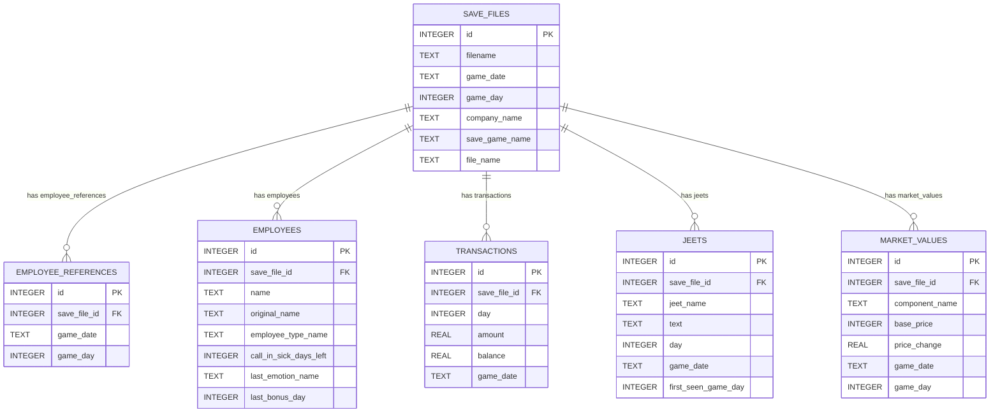

# Momentum AI Database ER Diagram

```mermaid
erDiagram

    SAVE_FILES {
        INTEGER id PK
        TEXT filename
        TEXT game_date
        INTEGER game_day
        TEXT company_name
        TEXT save_game_name
        TEXT file_name
    }

    EMPLOYEE_REFERENCES {
        INTEGER id PK
        INTEGER save_file_id FK
        TEXT game_date
        INTEGER game_day
    }

    EMPLOYEES {
        INTEGER id PK
        INTEGER save_file_id FK
        TEXT name
        TEXT original_name
        TEXT employee_type_name
        INTEGER call_in_sick_days_left
        TEXT last_emotion_name
        INTEGER last_bonus_day
    }

    TRANSACTIONS {
        INTEGER id PK
        INTEGER save_file_id FK
        INTEGER day
        REAL amount
        REAL balance
        TEXT game_date
    }

    JEETS {
        INTEGER id PK
        INTEGER save_file_id FK
        TEXT jeet_name
        TEXT text
        INTEGER day
        TEXT game_date
        INTEGER first_seen_game_day
    }

    MARKET_VALUES {
        INTEGER id PK
        INTEGER save_file_id FK
        TEXT component_name
        INTEGER base_price
        REAL price_change
        TEXT game_date
        INTEGER game_day
    }

    %% Primary Relationships
    SAVE_FILES ||--o{ EMPLOYEE_REFERENCES : "has employee_references"
    SAVE_FILES ||--o{ EMPLOYEES : "has employees"
    SAVE_FILES ||--o{ TRANSACTIONS : "has transactions"
    SAVE_FILES ||--o{ JEETS : "has jeets"
    SAVE_FILES ||--o{ MARKET_VALUES : "has market_values"
```